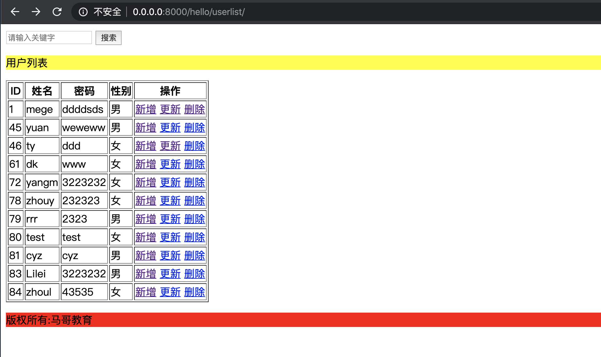
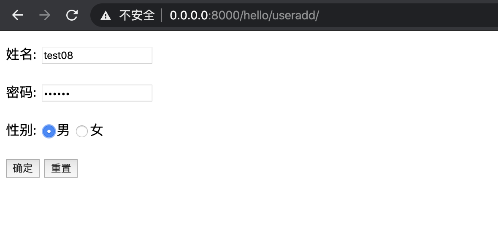
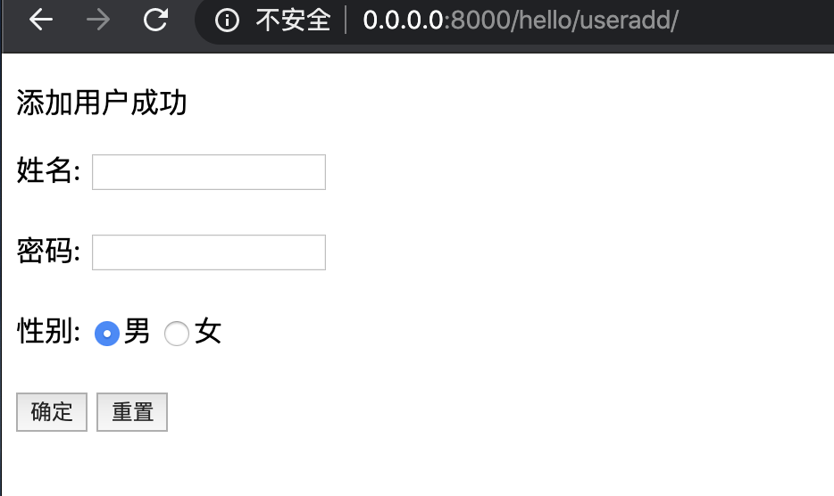
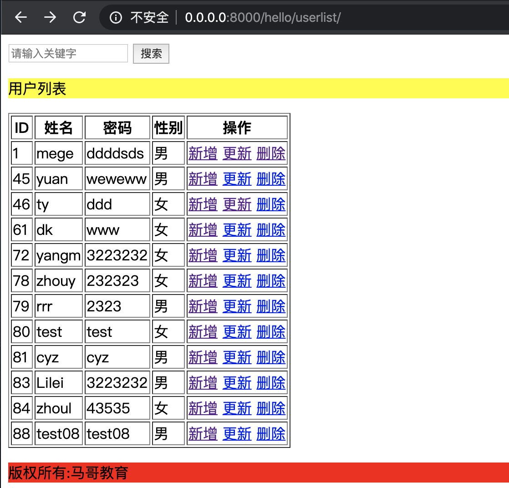
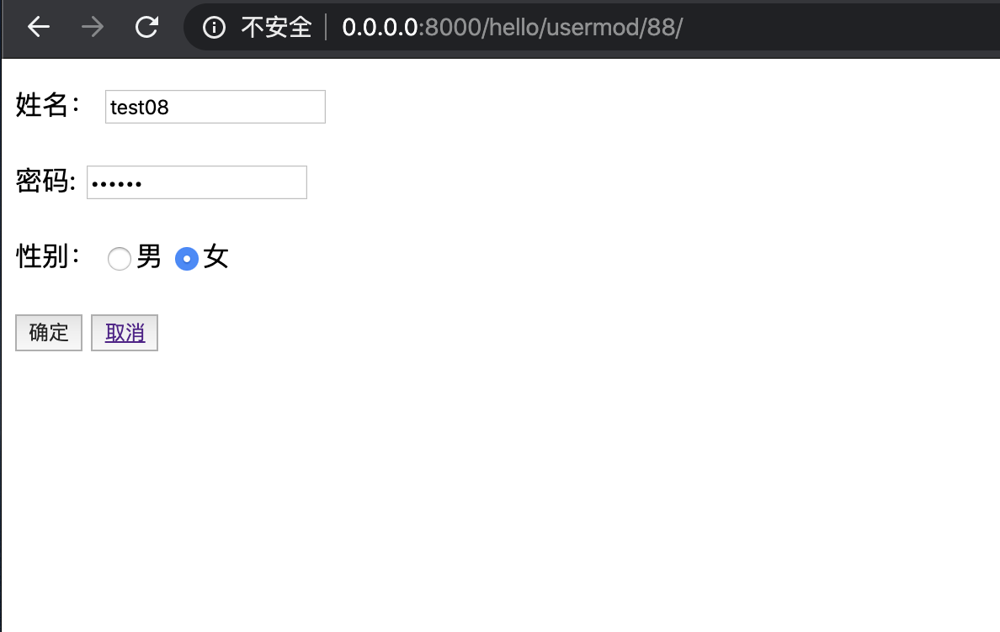
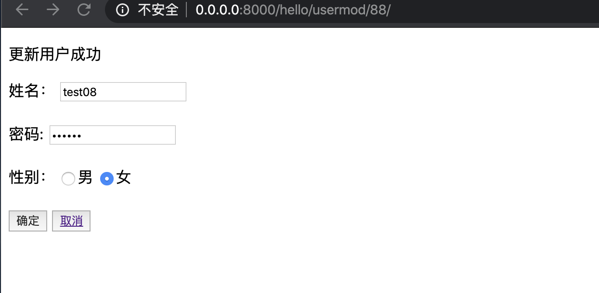
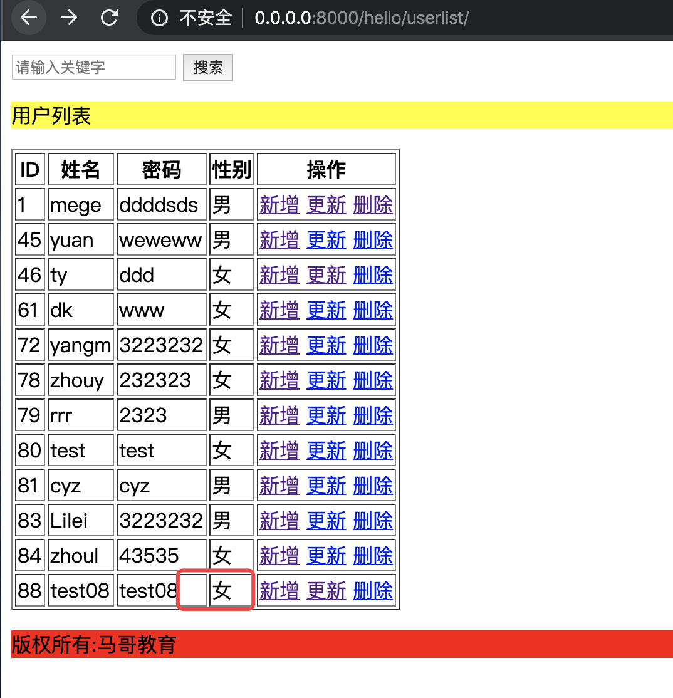
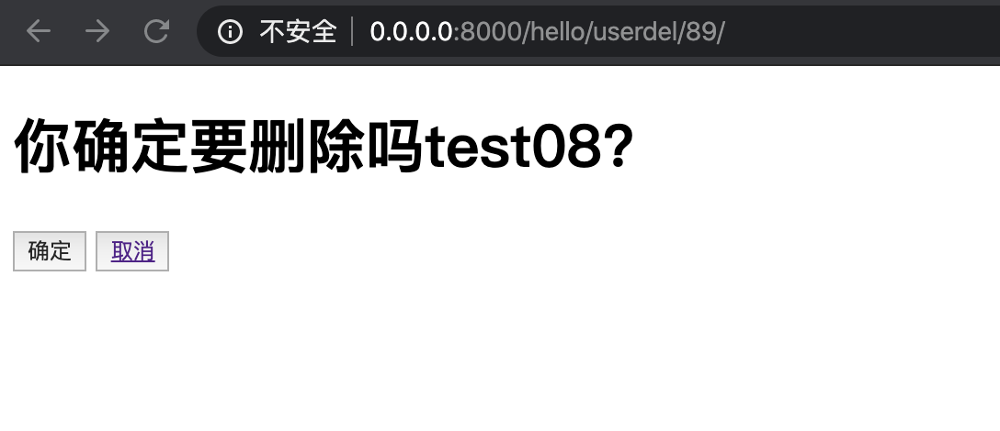
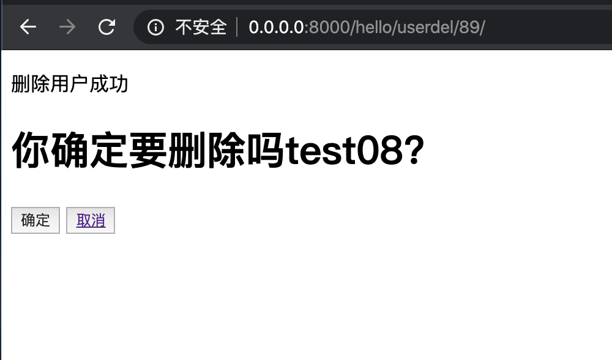
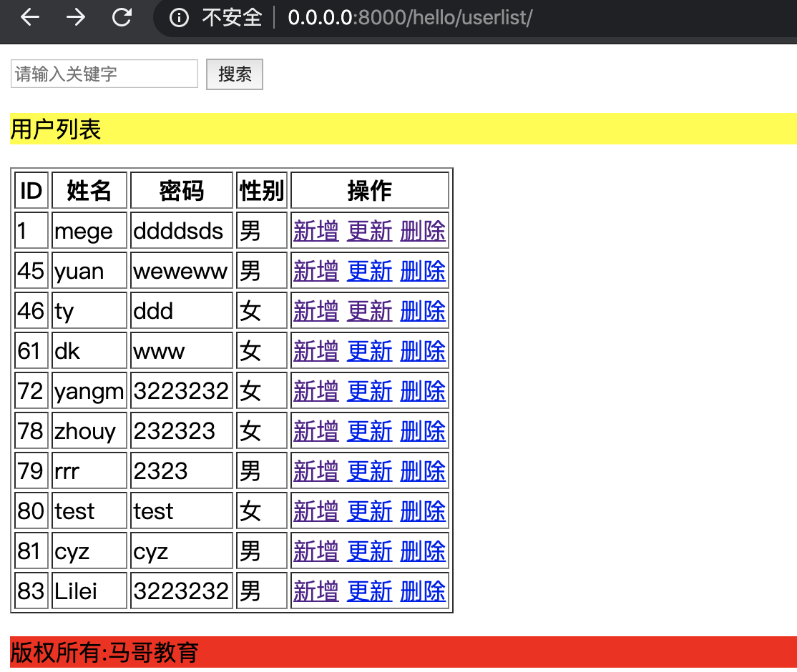

# 用户管理系统

##urls部分

        from django.contrib import admin
        from django.urls import path,re_path
        from . import views,views1
        import re
        app_name='hello'
        #普通参数
        urlpatterns = [
        
            #简易用户管理系统
        path('useradd/',views1.useradd,name='useradd'),
        path('userlist/',views1.userlist,name='userlist'),
        re_path('usermod/(?P<pk>[0-9]+)?/',views1.usermod,name='usermod'),
        re_path('userdel/(?P<pk>[0-9]+)?/',views1.userdel,name='userdel'),
          ]
   
   

## views部分

        from django.shortcuts import render
        from django.http import HttpResponse
        from django.http import QueryDict,Http404
        from django.shortcuts import get_list_or_404,get_object_or_404
        from hello.models import User
        import traceback
        
        def useradd(request):
            """添加用户
               request.POST.get -- 适用于获取单个变量进行处理的场景
               request.POST.dict() 适用于将所有表单数据进行处理的场景
               Form(request.POST)--适用于表单验证的场景
            """
            msg = {}
            if request.method == "POST":
                try:
                    print(request.POST)
                    #第一种方式，一个个获取值，然后一个个入库
                    # name=request.POST.get('name',"")
                    # password=request.POST.get('password',"")
                    # sex=request.POST.get('sex',"")
                    # print(name)
                    # u=User()
                    # u.name=name
                    # u.password=password
                    # u.sex=int(sex)
                    # u.save()
        
                    #第二种方式，将提交的数据转为字典，一次性入库
                    # name = request.POST['name']
                    # password = request.POST['password']
                    # sex = request.POST['sex']
                    # if sex == '男':
                    #     sex = 0
                    # if sex == '女':
                    #     sex = 1
                    # # print(username, sex, password)
                    # data = {'name': name, 'password': password, 'sex': sex }
                    # User.objects.create(**data)
        
                    data1=request.POST.dict()
                    print(data1)
                    User.objects.create(**data1)
                    msg = {"code": 0, "result": "添加用户成功"}
                except:
        
                    msg = {"code": 1, "errmsg": "添加用户失败: %s" % traceback.format_exc()}
            return render(request, "hello/useradd.html", {"msg": msg})
        
        
        def userlist(request):
            """
            用户列表&&用户搜索
            """
            keyword=request.GET.get("keyword","")
            print(keyword)
            users=User.objects.all()
            if keyword:
                users=users.filter(name__icontains=keyword)
            print(users)
            return render(request,'hello/userlist.html',{"users":users,"keyword":keyword})
        
        def usermod(request,**kwargs):
            """
             用户更新
             1.通过ID更新数据，并传到前端渲染
             2.将修改后的数据提交到后端
            """
            msg = {}
            print(kwargs)
            pk = kwargs.get("pk")
            user=get_object_or_404(User,pk=pk)
            if request.method == "POST":
                try:
                    data=request.POST.dict()
                    print(data)
                    User.objects.filter(pk=pk).update(**data)
                    msg={"code":0,"result":"更新用户成功"}
                except:
                    msg={"code":1,"errmsg":"更新用户失败：%s" %traceback.format_exc()}
            return render(request,"hello/usermod.html",{"user":user,"msg":msg})
        def userdel(request,**kwargs):
            """
            用户删除
            """
            msg = {}
            pk=kwargs.get("pk")
            try:
                #获取当前数据内容
                user=User.objects.get(pk=pk)
            except User.DoesNotExist:
                raise Http404
            if  request.method ==  "POST":
                try:
                    User.objects.get(pk=pk).delete()
                    msg={"code":0,"result": "删除用户成功"}
                except:
                    msg={"code":1,"errmsg":"删除用户失败：%s" %traceback.format_exc()}
            return render(request,"hello/userdel.html",{"user":user,"msg":msg})

 ## 实现效果
 ####用户查看
 
   
 ####用户新增
 
 
 
 
 
 ####用户修改
 
 
 
 
 ####用户删除
 
 
 