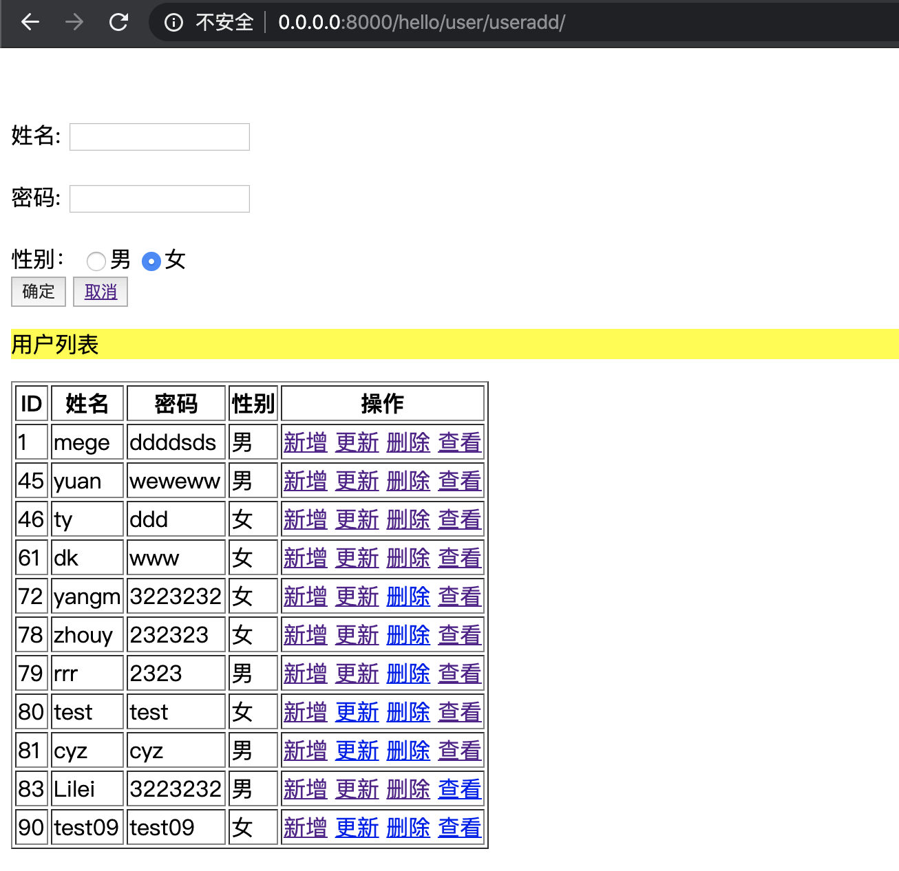

# 用户管理系统

##urls部分

        
        from django.contrib import admin
        from django.urls import path,re_path
        from . import views,views1,views2
        import re
        app_name='hello'
        
         
        urlpatterns = [
        
            #简易用户管理系统
        path('index/',views2.IndexView.as_view()),
        path('user/temp/',views2.Tempview.as_view(),name="Tempview"),
        path('user/userlist/',views2.UserListView.as_view(),name="listview"),
        path('user/useradd/',views2.UserCreateView.as_view(),name="createview"),
        re_path('user/detail/(?P<pk>[0-9]+)?/',views2.UserDetailView.as_view(),name="detailview"),
        re_path('user/usermod/(?P<pk>[0-9]+)?/',views2.UserUpateView.as_view(),name="updateview"),
        re_path('user/userdel/(?P<pk>[0-9]+)?/',views2.UserDelView.as_view(),name="delview"),
        ]
   
   

## views部分

        from django.shortcuts import render,reverse,redirect
        from django.http import  HttpResponse
        from django.http import QueryDict
        from django.http import QueryDict,Http404
        from hello.models   import  User
        from django.shortcuts import get_list_or_404
        from django.views.generic import View,ListView,TemplateView,UpdateView,DeleteView
        from django.views.generic import DetailView,CreateView
        
        class Tempview(TemplateView):
            template_name = "hello/index.html"  # 指定模板⽂文件
            context_object_name = "users"
            model = User
            def get_context_data(self, **kwargs):
                context = super(Tempview, self).get_context_data(**kwargs)
                context['users'] = User.objects.all()
        
                return context
        
            def post(self, request, *args, **kwargs):
                data = request.POST.dict()
                User.objects.create(**data)
                users = User.objects.all()
                return render(request, "hello/index.html", {"users": users})
          ##用户列表
        class UserListView(ListView):
            template_name= "hello/index.html"
            model=User
            context_object_name="users"
            keyword=""
        
            #http://0.0.0.0:8000/hello/user/userlist/?keyword=kk
            def get_queryset(self):
                queryset=super(UserListView,self).get_queryset()
                print(queryset)
                self.keyword=self.request.GET.get("keyword","")
                if self.keyword:
                    queryset=queryset.filter(name__icontains=self.keyword)
                return queryset
            def get_context_data(self,**kwargs):
                context=super(UserListView,self).get_context_data(**kwargs)
                context['keyword']=self.keyword
                print(context)
                return context
       
        
         ###用户detail http://0.0.0.0/hello/user/detail/3/
        class UserDetailView(DetailView):
            template_name = "hello/detail.html"
            #template_name = "hello/index.html"
            model = User
            context_object_name = "users"
        
            def get_success_url(self):
                return redirect(reverse('hello:detailview'))
            def get_context_data(self,**kwargs):
                context=super(UserDetailView,self).get_context_data(**kwargs)
                context['users'] = User.objects.all()
                print(context)
                return  context
        
            def post(self, request, *args, **kwargs):
                data = request.POST.dict()
                User.objects.get(pk=kwargs.get('pk'))
                users = User.objects.all()
                return render(request, "hello/detail.html", {"users": users})
        ##用户新加
        class UserCreateView(CreateView):
            template_name = "hello/detail.html"
            model = User
            fields = ('name','password','sex')
            #context_object_name = "users"
        
            def get_success_url(self):
                return reverse('hello:createview')
            def get_context_data(self, **kwargs):
                context=super(UserCreateView,self).get_context_data(**kwargs)
                context['users'] = User.objects.all()
                print(context)
                return context
            def post(self, request, *args, **kwargs):
                data=request.POST.dict()
                User.objects.create(**data)
                users = User.objects.all()
                return render(request, "hello/detail.html", {"users": users})
        ##用户更新
        class UserUpateView(UpdateView):
            template_name = "hello/detail.html"
            model = User
            fields = ('name', 'password', 'sex')
            #context_object_name = "users"
            #context_object_name = "users"
            def get_success_url(self):
                return reverse('hello:updateview',kwargs={'pk': self.kwargs['pk']})
            def get_context_data(self, **kwargs):
                context=super(UserUpateView,self).get_context_data(**kwargs)
                context['users'] = User.objects.all()
                print(context)
                return context
            def post(self, request, *args, **kwargs):
                data=request.POST.dict()
                #User.objects.create(**data)
                User.objects.filter(pk=kwargs.get('pk')).update(**data)
                users = User.objects.all()
                return render(request, "hello/detail.html", {"users": users})
        ##用户删除
        class UserDelView(DeleteView):
            template_name = "hello/detail.html"
            model = User
            context_object_name = "users"
            def get_success_url(self):
                return reverse('hello:delview',kwargs={'pk': self.kwargs['pk']})
            def get_context_data(self, **kwargs):
                context=super(UserDelView,self).get_context_data(**kwargs)
                context['users'] = User.objects.all()
                return context
        
        
            def post(self, request, *args, **kwargs):
                data = request.POST.dict()
                User.objects.get(pk=kwargs.get('pk')).delete()
                users = User.objects.all()
                return render(request, "hello/detail.html", {"users": users})

 ## 实现效果
 ####用户查看
 
   
 ####用户搜索
 
 ####用户新增
 
 
 
 
 ####用户修改
 
 
 
 
 
 ####用户删除
 
 
 
 
 
 ####用户查看
  
  